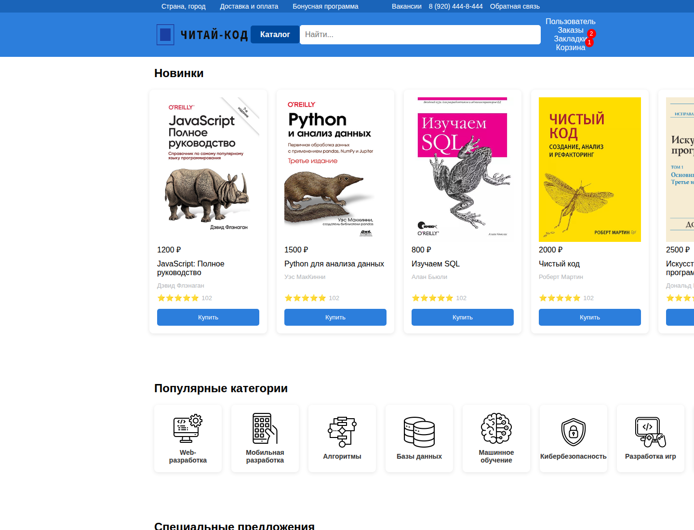

# Читай-код

Учебный проект интернет-магазина книг по программированию. Работа выполнена для курсовой работы по дисциплине «Разработка WEB-представительств».

[Открыть демо](https://gogolevmatvey.github.io/read-code/)



## О проекте

«Читай-код» — статический интерфейс книжного интернет-магазина для программистов и IT-специалистов. Проект демонстрирует структуру и пользовательские сценарии магазина: просмотр ассортимента, переход к карточкам книг, работу с профилем, избранным и корзиной, а также информационные разделы.

## Реализованные страницы

- главная страница с новинками, категориями и специальным предложением;
- каталог и карточки книг;
- профиль, настройки, история заказов, избранное и корзина;
- доставка и оплата, бонусная программа, вакансии, правила продажи и политика конфиденциальности;
- форма обратной связи.

## Технологии

- HTML5;
- CSS3;
- статические изображения и иконки.

## Запуск

Проект не требует сборки или установки зависимостей. Откройте `index.html` в браузере либо используйте любой локальный HTTP-сервер из корня репозитория.

## Структура

```text
index.html                  главная страница
catalog.html, product*.html каталог и карточки книг
*-style.css, style.css      стили страниц
book-images/                обложки книг
category-icons/             иконки категорий
docs/images/                изображения для документации
```
